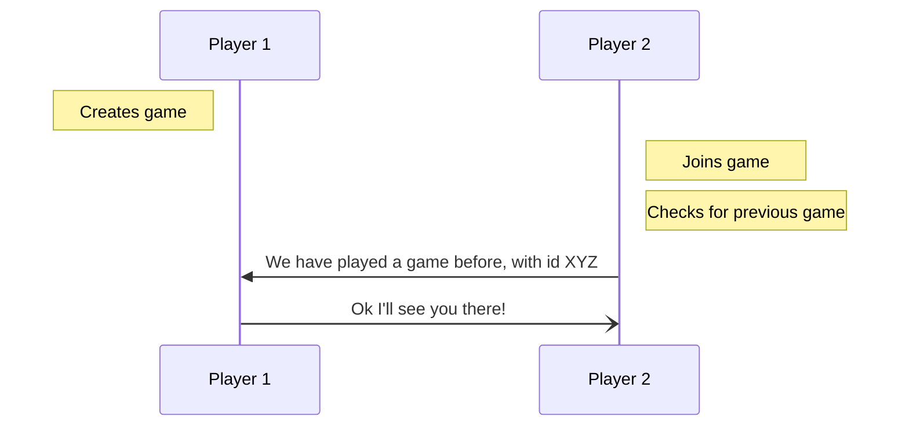

# TicTacToe


<a href="https://apps.apple.com/us/app/tic-tac-toe-modern/id1641960233?itscg=30200&amp;itsct=apps_box_appicon" >

</a>

<br>
<p align="left">
<a href="https://apps.apple.com/us/app/tic-tac-toe-modern/id1641960233?itsct=apps_box_badge&amp;itscg=30200" style="display: inline-block; overflow: hidden; border-radius: 13px; width: 250px; height: 83px;"></a>
</p>
<br>


iOS app which allows multiplayer gameplay using Firebase Firestore Database.

I started this project with the goal of being able to play TicTacToe with a friend on my iPhone. Once finished, I compared my app to those on the App Store and noticed that most had implemented an online feature such that people could play remotely. I thought the feature was cool, but most had implemented the online portion of the game using Game Center or some other way which made their game difficult to play or visually unappealing. With that analysis, my new objective became creating a game which had the following features:
* can be played online
* is simple to use
* is visually appealing
<br>

I want to use this space to detail my experience creating this app and help others who wish to do something similar. For reference, the offline portion of this game took 2 hours to complete, while the online features took ~30 hours. I'll detail the choices I made, the goals I had, and the achievements I made. I can still see problems coming up with this app. Sometimes it haunts me at night. If I were to make this app again, I would likely do it very differently. However, at this point I'm not sinking anymore time into a Tic-Tac-Toe game.

<!-- is video prev on slack, will center later -->
##
https://user-images.githubusercontent.com/22779354/188781869-bf65c93e-5eed-496e-9aa5-1278b7c8836d.mp4
##
<br>


## Table of contents
<!-- * [General info](#general-info) -->
* [Technologies](#technologies)
* [Setup](#setup)
* [The Game](#the-game)
  * [Local Play](#local-play)
  * [Multiplayer](#multiplayer)
	  * [Information stored in database](#Information-stored-in-database)
	  * [Firebase](#Firebase)
	  * [Potential problems - and how to avoid](#Potential-problems---and-how-to-avoid)
		  * [Rematch](#Rematch)
		  * [Snapshot listener](#Snapshot-listener)
  * [Friends](#Friends)
* [Concluding thoughts](#Concluding-thoughts)

<!--
<a href="https://apps.apple.com/us/app/tic-tac-toe-modern/id1641960233?itsct=apps_box_badge&amp;itscg=30200" style="display: inline-block; overflow: hidden; border-radius: 13px; width: 250px; height: 83px;"></a>
-->
<!-- ## General info -->


## Technologies
Project is created with:
* Swift version 5.2
* Firebase Firestore Database
* Xcode version 13.4.1
* [CocoaPods](https://cocoapods.org/pods/Firebase) version 1.11.3

## Setup
Project was created in Xcode as an iOS app with a storyboard interface using Swift language.
[Add Firebase to your Apple project](https://firebase.google.com/docs/ios/setup).
* Demonstrates various methods of [installing Firebase in your Apple app](https://firebase.google.com/docs/ios/installation-methods)


## The Game
The game UI is designed using a 3x3 grid of buttons. Each time the board is tapped, the title of that button is set to the current string ("X" or "O").

```swift
var board = [UIButton]()

// 1 of the 9 buttons
@IBOutlet weak var a1: UIButton!
	...

func initBoard () {
    board.append(a1)
    ...
}

override func viewDidLoad(){
    super.viewDidLoad()
    initBoard()
    getColorScheme()
}
```

## Local Play
When a player taps on a button on the board, several things need to happen in a certain order:

1. Check if move is legal (i.e. button is empty)
	1a. Make move
	1b. Update labels
	1c. Change turn
<!--
```swift
func addToBoard (_ sender: UIButton) {
	// button isn't already set
    if sender.title(for: .normal) == nil {

        // set title to current player's char
        sender.setTitle(currentTurn ? char1 : char2, for: .normal)
        sender.setTitleColor(currentTurn ? .blue : .red, for: .normal)
        currentTurn = !currentTurn
    }
    turnLabel.text = currentTurn ? "X" : "O"
    turnLabel.textColor = currentTurn ?  .blue: .red

    sender.isEnabled = false
}
```
-->

2. Check if there is a winner
<!--
```swift
if checkForVictory("X") {
    crossesScore += 1
    xWinDisplay.setTitle(String(crossesScore), for: .normal)
    resultAlert(title: "X Wins!")
}
```
-->

2a. If there is a winner, increment their score, alert the players
```swift
func resultAlert(title: String) {
	// UIAlertController must be of style type .alert for iPadOS not to raise problems
    let ac = UIAlertController(title: title, message: nil, preferredStyle: .alert)
    ac.addAction(UIAlertAction(title: "Reset", style: .default, handler:{ (_) in self.resetBoard()}))
    self.present(ac, animated: true)
}
```

##

<p align="center">
  
  &nbsp;
  &nbsp;
  &nbsp;
  &nbsp;
  &nbsp;
  
</p>


##

<br>

## Multiplayer
For the most intricate part of this game I want to detail a few things:
* Info stored in database
* How to use Firebase (for those interested in developing)
* Design choices I made
	* Potential problems
		* Rematch
		* Snapshot listener
	* Finding previous games

### Information stored in database
One Game object is stored in each document.
```swift
import UIKit
struct Game: Codable {
    var id: String

    var player1Name: String
    var player2Name: String

    var player1Id: String
    var player2Id: String

    var player1Score: Int
    var player2Score: Int

    var blockMoveForPlayerId: String
    var waitForResetPlayer1 : Bool
    var waitForResetPlayer2 : Bool

    var move : Int

    var prevGameId : String
}
```
How it looks:


 _
 <br>

### Firebase
Firebase has a multitude of features that can be used to help develop apps. The feature I used is called a Cloud Firestore Database. Firebase also offers a Realtime database that you can use for other types of applications. You can read about which suits your needs [here](https://firebase.google.com/docs/database/rtdb-vs-firestore).

When a player chooses to create a game on the app. Several things must happen in order. Since this is now an online multiplayer game, the source of truth is no longer on any local device, it is now on the database. It is important that no read/write conflicts occur, since that could cause the game to malfunction. Redundancies must be made.
<br>
To simplify querying the database, I used a function to streamline the program. The following function states that we will be writing to our Game collection in the database, the only collection I stored. If the collection doesn't exist (which at one point it didn't), a new collection will be made.
``` swift
enum FCollectionReference: String {
    case Game
}

func FirebaseReference(_ collectionReference: FCollectionReference) -> CollectionReference {
    return Firestore.firestore().collection(collectionReference.rawValue)
}
```
<br>
Now it is possible to query this collection. Adding, deleting, and modifying documents at will.

1. First, a local game needs to be instantiated and then set online.
``` swift

func createNewGame(with userId: String) {
    let anId = (UUID().uuidString).prefix(8)
    self.game = Game(id: String(anId), player1Name: self.currentUser.name, player2Name: "", player1Id: userId, player2Id: "", player1Score: 0, player2Score: 0, blockMoveForPlayerId: userId, waitForResetPlayer1: false, waitForResetPlayer2: false, move: -1, prevGameId: "")
    self.createOnlineGame()
}

func createOnlineGame() {
    do {
	    // the line below is of great significance
        try FirebaseReference(.Game).document(self.game.id).setData(from: self.game)
        self.waitingLabel.setTitle(" Game is online ", for: .normal)
        self.listenForGameChanges()
    } catch {
        print("Error creating online game", error.localizedDescription)
    }
}
```
I'll yet again reiterate the importance of how the database is queried. In a line above, I highlight the following line:

```swift
try FirebaseReference(.Game).document(self.game.id).setData(from: self.game)
```
Several things of importance are going on here. First, notice how I was able to set the data on the document. The game object is a subclass of codable. Cloud Firestore converts the objects to supported data types.

The variable I use to name and parse my game documents is a variable named id, it is a truncated uuidString. If the document with the given id does not exist, which it shouldn't, it will be created. If the document does exist, ***its contents will be overwritten with the newly provided data***, unless you specify that the data should be merged into the existing document. You can read more about adding data [here.](https://firebase.google.com/docs/firestore/manage-data/add-data)

So there is now a joinable game in the database, what now? There needs to be an organized way to join games, whether the player would like to join a friend or auto-matchmake.

If a gameId is provided when a player presses 'Join', the following line will run:
```swift
FirebaseReference(.Game).whereField("player2Id", isEqualTo: "").whereField("id", isEqualTo:  gameId).getDocuments
```
This line determines if the gameId provided is valid and if the game is joinable (there isn't a player2 in the game already).

If no results are found because the gameId was incorrect, a second player already joined, or a gameId wasn't provided, then the database needs to be queried to find an open game; an open game being a game where there isn't a player 2, and I am not player 1.

```swift
FirebaseReference(.Game).whereField("player2Id", isEqualTo: "").whereField("player1Id", isNotEqualTo: userId).getDocuments
```
At this step you should be wondering how it's possible that a user can be player 1 in an empty game while searching for a game to join. If the user creates a game, then force quits the application, there will temporarily be an open game on the database. This open game will remain on the database until one of three things happens.
1. The user opens the app and attempts to join or create a new game
	* The app recognizes that the user has an open game and deletes the unused game
2. After a short period of time, the database clears any games which don't have a second player
3. Another player joins the open game
	* Obviously player 1 isn't part of the game, but that won't be entirely clear to player 2
	* The game will be deleted once player 2 closes the view

Given the way I designed this game, there isn't a shorthand way around this issue. I plan on patching this when I have the time by adding the [applicationwillterminate](https://developer.apple.com/documentation/uikit/uiapplicationdelegate/1623111-applicationwillterminate) function to AppDelegate. This will make the app run silky smooth, it's just reading and programming that will take time to do.

But anyways, let's say all goes to plan. Player 2 finds a joinable game.
```swift
if let gameData = querySnapshot?.documents.first {
   self.game = try? gameData.data(as: Game.self)
   self.game.player2Id = userId
   self.game.player2Name = self.currentUser.name
   self.game.blockMoveForPlayerId = userId
   self.checkForPrevGame(with: userId)
}
```
We set the variables in our local game to equate the variables in our database. But we don't alert the other player just yet as to whether we have joined their game. This was a design choice I made in how players would get back into their previous games. Once player 2 joins the game, player 2 checks if they have played with player 1 before.

First player 2 checks if they and the other player played a game before where player 2 was player 2 in the previous game and player 1 was player 1 in the previous game.  If they haven't then player 2 checks if  they and the other player played a game before where player 2 was player 1 in the previous game and player 1 was player 2 in the previous game. If this isn't the case, then they haven't played a game before and they should remain in the new game.


```swift
func checkForPrevGame(with userId: String, _ deleteCurrGame: Bool = false) {

        // I am now player 2 in a game, have I and this player played a game before?
    self.waitingLabel.setTitle("...Loading Game...", for: .normal)
    FirebaseReference(.Game).whereField("player2Id", isEqualTo: self.currentUser.id).whereField("player1Id", isEqualTo: self.game.player1Id).whereField("id", isNotEqualTo: self.game.id).getDocuments { querySnapshot, error in

        if error != nil {
            return
        }
        if let prevGameData = querySnapshot?.documents.first {
            self.prevGame = try? prevGameData.data(as: Game.self)

            // have to block game for myself, I am "O", and i gotta wait for x
            self.prevGame.blockMoveForPlayerId = userId
            // i was player 2 in our previous game

            self.game.prevGameId = self.prevGame.id
            self.updateGame(self.game)
            self.hasGameStarted = true

            self.game = self.prevGame

            if self.game.player2Name != self.currentUser.name {
                self.game.player2Name = self.currentUser.name // user has changed names
            }

            self.updatePlayerLabels()

            self.oPlayer.isHighlighted = true
            self.oPlayer.highlightedTextColor = UIColor(red:0.0, green:0.55, blue:0.15, alpha:1.0)

            self.crossesScore = self.game.player1Score
            self.noughtsScore = self.game.player2Score

            self.updateScore()

            self.waitingLabel.setTitle("...Opponents Move...", for: .normal)

            self.listenForGameChanges()

            return
        }
        else {
            // have we played a game before where I was player1 ?
            print("checkprev Line 204")
            FirebaseReference(.Game).whereField("player2Id", isEqualTo: self.game.player1Id).whereField("player1Id", isEqualTo: self.currentUser.id).whereField("id", isNotEqualTo: self.game.id).getDocuments { querySnapshot, error in
                if error != nil {
                    return
                }

                if let prevGameData = querySnapshot?.documents.first {
                    // we have, I was player1 and other was player 2

                    self.prevGame = try? prevGameData.data(as: Game.self)

                    // have to block game for myself, am "X", need to wait for "O"
                    self.prevGame.blockMoveForPlayerId = userId
                    // i am player 1 from prev game
                    self.xPlayer.isHighlighted = true
                    self.xPlayer.highlightedTextColor = UIColor(red:0.0, green:0.55, blue:0.15, alpha:1.0)
                    self.game.prevGameId = self.prevGame.id

                    self.updateGame(self.game)

                    self.game = self.prevGame

                    if self.game.player1Name != self.currentUser.name {
                        self.game.player1Name = self.currentUser.name // user has changed names
                    }

                    self.updatePlayerLabels()

                    self.xPlayer.isHighlighted = true
                    self.xPlayer.highlightedTextColor = UIColor(red:0.0, green:0.55, blue:0.15, alpha:1.0)

                    self.crossesScore = self.game.player1Score
                    self.noughtsScore = self.game.player2Score

                    self.updateScore()

                    self.waitingLabel.setTitle("Game Started", for: .normal)

                    self.listenForGameChanges()

                    return
                } else {
                // can now let player 1 know to start game
                    self.updateGame(self.game)
                    self.waitingLabel.setTitle("Game Started", for: .normal)
                    self.listenForGameChanges()
                    self.updatePlayerLabels()

                    self.oPlayer.isHighlighted = true
                    self.oPlayer.highlightedTextColor = UIColor(red:0.0, green:0.55, blue:0.15, alpha:1.0)
                }
            }
        }
    }
    return
}
```
<br>
As you can see, this function is a lot, and working out the logic of it took time. Essentially it's just this:


<br>

Now that both players are in a game together, they need to play! This is where it becomes important what type of database is used, what data is stored, and how data is [read from the database](https://firebase.google.com/docs/firestore/query-data/get-data).

If specific functions are used inefficiently, incorrectly, or not at all, there could potentially be excess battery drain. One of my objectives was to keep the battery usage and app size low. In order to do this, I had to ensure that the database was being used as efficiently as possible. and so it boiled down to one question, ***after one player makes a move, how is the other player's device notified?***

Firebase has functionality which allows the client to be notified of and receive data in a rather efficient manner. They explain it in high detail on their [site](https://firebase.google.com/docs/firestore/query-data/listen), so I'm only going to touch on its functionality briefly. Basically, the client creates a listener which is essentially a callback that the sdk executes when there is new data available on the database. Over on the database it will create a process which monitors our specific query to see if there is any new data available. The only data that is sent to the client is data that has been mutated.

```swift
let listener = FirebaseReference(.Game).document(self.game.id).addSnapshotListener
```

Thus, creating a snapshot listener binds it to listen to the document. **It is important that you keep ahold of the listener object**. Once we are done with the game, and this is straight from the site, "You must detach your listener so that your event callbacks stop getting called. This allows the client to stop using bandwidth to receive updates". I might be going into too much detail, so I'll just [link](https://firebase.google.com/docs/firestore/query-data/listen) where you can read all this for yourself if interested.

I'm going to show the whole function below because it's one of the more significant ones used in the game, and the logic behind it is important.

```swift
@Published var Listener: ListenerRegistration!

func listenForGameChanges() {
    guard self.game != nil else { return }
    let listener = FirebaseReference(.Game).document(self.game.id).addSnapshotListener { documentSnapshot, error in
        if error != nil {
            print("Error getting updates")
            return
        }
        if let snapshot = documentSnapshot {
            self.game = try? snapshot.data(as: Game.self)
            guard self.game != nil else { return }
            if (self.game.prevGameId != "") {
                self.game.blockMoveForPlayerId = self.currentUser.id
                FirebaseReference(.Game).whereField("id", isEqualTo: self.game.prevGameId).getDocuments { querySnapshot, error in

                    if error != nil {
                        print("Error joing PrevGame, line 186")
                        self.waitingLabel.setTitle(" Error With Database Joining Game ", for: .normal)
                        return
                    }
                    if let prevGameData = querySnapshot?.documents.first {
                        self.waitingLabel.setTitle(" Loading Game ", for: .normal)
                        self.moveGames(with: prevGameData)
                    }
                }
            }
            print("changes received from Firebase, move: ", self.game != nil ? self.game!.move : "Game quit")

            if !(self.game != nil) {
                self.waitingLabel.setTitle("Opponent Left", for: .normal)
                return
            }
            self.updatePlayerLabels()
            self.waitingLabel.setTitle((self.game.blockMoveForPlayerId != self.currentUser.id) ? " Your Move " : " Opponent's Move ", for: .normal)
            if self.game.player2Id == "" {
                self.waitingLabel.setTitle(" Waiting For Opponent ", for: .normal)
            }
            if (self.checkGamePlayerStatus() && self.game.move != -1 && !self.game.waitForResetPlayer1 && !self.game.waitForResetPlayer2) {
                self.updateOpponent()           
            }
        }
    }
    self.Listener = listener
}
```

<br>

### Potential problems - and how to avoid
#### Rematch
The game finishes. Both players press rematch at the same time. We must ensure they each modify only one value: whether they are cleared for the next game.
```swift
FirebaseReference(.Game).document(self.game.id).updateData
```

When the game ends, the value of waitForResetPlayer1 and waitForResetPlayer2 is set to true for each player **locally**. When each player selects the rematch button at the end of their game, they locally clear themselves to play a new game, and then update that value in the database. Now imagine both players press rematch at the same time.  A race condition occurs in the database. Both players want the database to be set to match their local game values, but the values are at odds with each other. This is one instance where it was incredibly important to only modify a specific value, and not set all the values in the database.
```swift
func resultAlert(title: String) {
    let ac = UIAlertController(title: title, message: nil, preferredStyle: .alert)
    ac.addAction(UIAlertAction(title: "Rematch", style: .default, handler:
                                   { (_) in self.resetBoard()
        if self.game != nil {
            self.clearPlayerForGame()
            FirebaseReference(.Game).document(self.game.id).updateData([
               ((self.currentUser.id == self.game.player1Id) ?
                                       "waitForResetPlayer1" :
                                       "waitForResetPlayer2" )
                                                     : false ])
        }}))
    self.present(ac, animated: true, completion: nil)
}
```
At this point you might have realized my love for the ternary operator :)

<br>

#### Snapshot listener
Short and sweet (but important): remove the snapshot listener if the client shouldn't be getting updates on data. For other applications, where data might be [updated several times in the background without the client needing it](https://firebase.google.com/docs/firestore/query-data/listen) or using it, it might be beneficial to remove the listener and then retrieve it when the client returns to the application.
```swift
self.Listener.remove()
```
<br>
<br>

## Friends
As you'll see if you play the game, the user has the ability to add friends, join friends with open games, and change their own name. To enable this functionality, there must be a method by which we store this data such that no errors occur. Using a UUID(Universally unique identifier) we can identify players regardless if their name has changed.
```swift
class User: Codable { // struct
    var id = UUID().uuidString
    var name: String
    var friends: [[String]]
    var friendToJoin: String

    init(_ personName: String) {
        self.name = personName
        self.friends = []
        self.friendToJoin = ""

    func changeNameTo(_ aName: String) {
        self.name = aName
    }

    func addUserFriend(_ friendName: String, _ friendId: String) {
        let fr = [friendName, friendId]
        self.friends.append(fr)
    }
}
```
You'll note above that I store both the user's name and their UUID, even though I said I would only use their UUID to track them. This is because if they change their name, I need to know what it was before, so that I can alert the user that their friend is now using a different alias. This way, we get some cool functionality when we check our friends list, here is an example (note that once the available friends list is refreshed, the friends' new alias is stored.

<p align="center">
  
  &nbsp;
  &nbsp;
  &nbsp;
  &nbsp;
  &nbsp;
  
</p>


## Concluding thoughts
Feature currently in development:
* Notifications
When two people play a game and one user enters the background while the other makes a move, the app will still function. The user can reopen the app and they will see the other players move. I am in the process of adding a notification so that the players are notified that their opponent made a move while the app wasn't open.


To do list:
* Improve friends list (I think its ugly)
* Add functionality to play multiple games at once, essentially a lobby with current games with friends
* Improve code (remove the bugs that haunt me)

I hope this gave you some insight into what went into making an app which seems so simple at first, and for people looking to develop something similar I truly hope this Information benefited you.
#

Find a friend, try the game! If you have any question, advice, or need to reach out for any reason, feel free: ethanb@nyu.edu

<a href="https://apps.apple.com/us/app/tic-tac-toe-modern/id1641960233?itsct=apps_box_badge&amp;itscg=30200" style="display: inline-block; overflow: hidden; border-radius: 13px; width: 250px; height: 83px;"></a>
